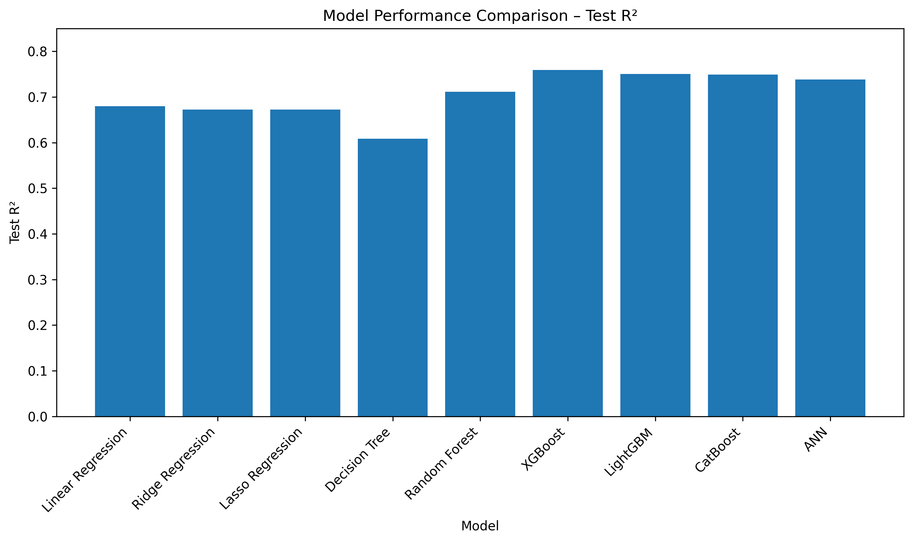
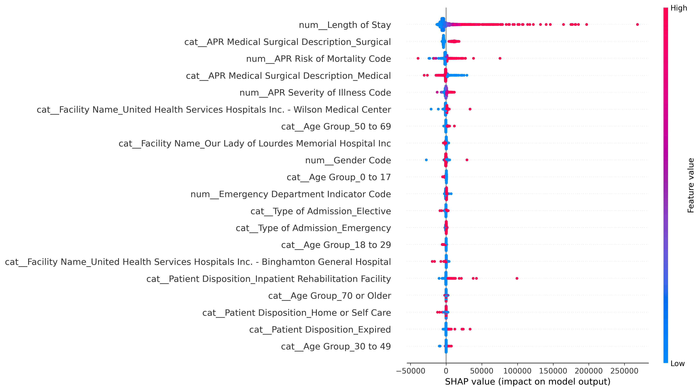

# 🏥 Hospital Inpatient Cost Prediction

Predicting hospital inpatient charges using machine learning — helping healthcare providers forecast costs, plan resources, and support insurance/billing decisions before or during a patient's stay.


---

## 📌 Problem

Hospitals sit on huge volumes of admission, diagnosis, and treatment data — but struggle to translate it into accurate cost forecasts. This project builds a regression model that predicts **Total Charges** for an inpatient using demographic, clinical, and admission features, and surfaces the key cost drivers behind those predictions.

**Dataset:** [SPARCS Hospital Inpatient Discharges](https://health.data.ny.gov/) — New York State Department of Health · 32,033 rows · 34 columns

## 💡 Business Value

- Improve hospital financial planning and budgeting
- Estimate treatment costs before/during hospitalization
- Support insurance claim processing
- Identify high-cost patient groups early
- Enable data-driven resource allocation

## 🔧 Approach

| Phase | What was done |
|---|---|
| Data Cleaning | Removed high-missing columns, imputed categoricals, parsed currency fields |
| EDA | Analyzed cost drivers across age, admission type, severity, payer, diagnosis |
| Feature Engineering | Ordinal encoding (severity/risk), binary encoding, high-cardinality category grouping |
| Modeling | 8 algorithms benchmarked: Linear/Ridge/Lasso, Decision Tree, Random Forest, XGBoost, LightGBM, CatBoost, and a TensorFlow ANN |
| Tuning | RandomizedSearchCV hyperparameter search on XGBoost |
| Explainability | Feature importance + SHAP analysis on the final model |

## 📊 Results

| Model | Test MAE | Test RMSE | Test R² |
|---|---:|---:|---:|
| Linear Regression | 6,789.23 | 11,965.11 | 0.6796 |
| Ridge | 6,726.49 | 11,856.44 | 0.6725 |
| Lasso | 6,726.62 | 11,857.06 | 0.6724 |
| Decision Tree | 6,063.91 | 12,969.71 | 0.6081 |
| Random Forest | 5,166.24 | 11,129.92 | 0.7114 |
| **XGBoost** ⭐ | **4,840.42** | **10,160.79** | **0.7594** |
| LightGBM | 4,884.99 | 10,347.54 | 0.7505 |
| CatBoost | 5,096.57 | 10,372.12 | 0.7493 |
| ANN (TensorFlow) | 5,348.15 | 10,599.60 | 0.7382 |

**XGBoost was selected as the final model** — best test performance across all three metrics, and it beat a tuned neural network.

<!-- Add exported chart images here, e.g.: -->
<!--  -->
<!--  -->

## 🔍 Key Insights

- **Length of Stay** is the single strongest predictor of charges — longer stays drive higher costs.
- **Medical vs. Surgical classification** matters a lot: surgical cases push predictions up, medical cases down.
- **Severity of illness and risk of mortality** meaningfully shift cost predictions.
- The model struggles most with extreme high-cost outlier cases — residual spread increases at the top end.

## 🗂️ Repo Structure

```
├── notebooks/hospital-cost-prediction.ipynb   # full analysis, end to end
├── images/                                    # exported charts for this README
├── requirements.txt
└── README.md
```

## 🚀 Future Work

- Deploy the model as an API for real-time cost prediction
- Validate against newer/external hospital datasets for generalizability
- Further feature engineering to reduce error on high-cost outliers

## 🛠️ Tech Stack

`Python` · `Pandas` · `Scikit-learn` · `XGBoost` · `LightGBM` · `CatBoost` · `TensorFlow/Keras` · `SHAP` · `Matplotlib/Seaborn`

---

⭐ If you found this useful, consider starring the repo!
